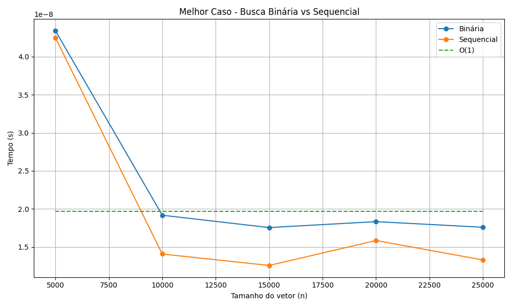
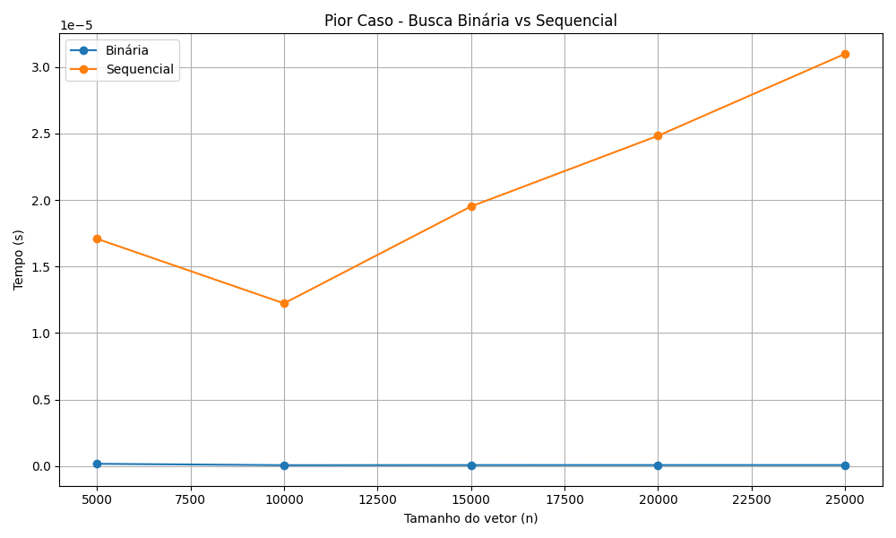
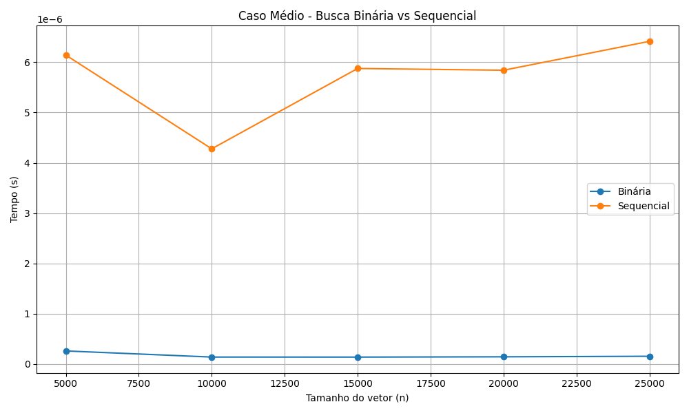
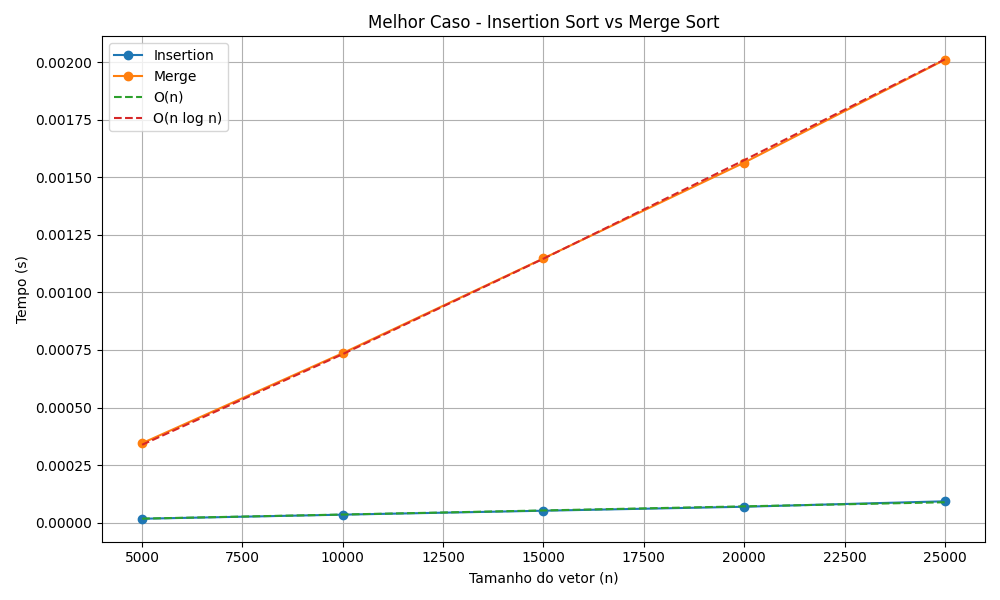
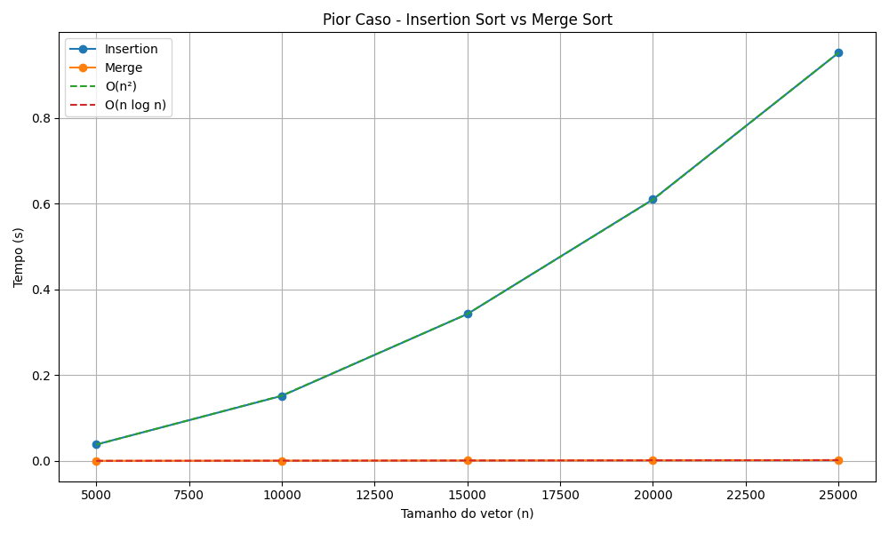
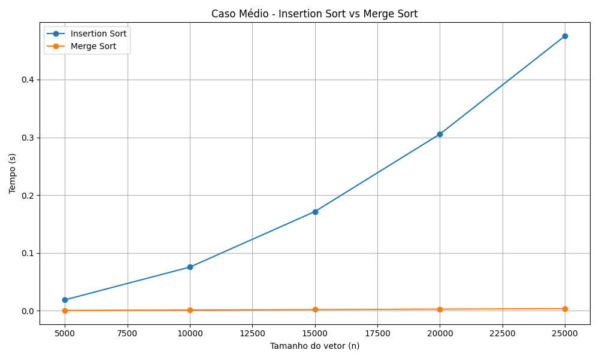

# Análise Empírica de Complexidade de Algoritmos

## Introdução
A complexidade de algoritmos é uma área importante de estudo da computação que mede a eficiência de tempo e espaço de um código conforme sua entrada cresce, sendo fundamental para projetar algoritmos eficientes. Sua principal forma de representação é a notação Big O, que expressa a complexidade de forma assíntota, ignorando constantes e termos de menor ordem, e focando apenas na taxa de crescimento. Tal abordagem é predominantemente teórica.

Outra forma de avaliar a complexidade de algoritmos é o método empírico, que consiste na observação, experimentação e coleta de dados reais de execução. Esse método busca quantificar a complexidade com base em dados concretos.

Desse modo, para efeito de comparação com o método teórico de análise de complexidade de algoritmos, neste trabalho foi realizada uma análise empírica de algoritmos de busca e ordenação. Foram considerados os algoritmos de busca sequencial, com complexidade O(n), e busca binária, com complexidade O(log n), além de dois algoritmos de ordenação: insertion sort, com complexidade O(n²) nos casos médio e pior, e O(n) no melhor caso, e merge sort, com complexidade O(n log n). Os resultados experimentais obtidos foram, então, comparados com os comportamentos esperados segundo a análise teórica.

## Metodologia
O estudo foi desenvolvido utilizando a linguagem de programação C++, responsável pela implementação e execução dos algoritmos. Já a linguagem python foi empregada de modo auxiliar, sendo utilizada para a geração e visualização dos gráficos a partir dos dados obtidos.

Para a obtenção dos resultados foi implementada uma função responsável por importar todos os algoritmos de busca e ordenação. Além disso, foi criado um módulo responsável pela geração de vetores de tamanho n, contendo elementos crescentes ou aleatórios.

Para a medição de desempenho, foi utilizada a biblioteca **chrono**, responsável por calcular o tempo de execução de cada algoritmo. Cada execução foi realizada 50 vezes, com o objetivo de minimizar variações causadas por fatores externos. As análises foram realizadas considerando os cenários de melhor, médio e pior caso para todos os algoritmos. Ao final, foi calculada a média dos tempos obtidos, e os resultados foram gravados em um arquivo .csv, utilizado posteriormente para a geração dos gráficos.

## Resultados
### Algoritmos de Busca
A análise teórica de complexidade da busca binária e da busca sequencial aponta que no pior caso esses algoritmos possuem complexidade de O(log n) e O(n) respectivamente, enquanto ambas possuem mesma complexidade de melhor caso: O(1), pois o elemento é encontrado já na primeira verificação.

#### Melhor caso:

No gráfico de melhor caso, observa-se que tanto a busca binária quanto a busca sequencial apresentam tempos de execução praticamente constantes e similares, independentemente do tamanho da entrada, com poucas divergências.

Essas pequenas variações não seguem um padrão de crescimento e podem ser atribuídas a fatores como overhead de execução e limitações na precisão da medição. Dessa forma, os resultados confirmam a análise teórica, segundo a qual ambos os algoritmos apresentam complexidade O(1) no melhor caso.

#### Pior caso:

Já no pior caso, observa-se um comportamento distinto entre os algoritmos. 

A busca sequencial apresenta um crescimento aproximadamente proporcional à medida em que a entrada cresce, passando de aproximadamente 1,7×10⁻⁵ s para n = 5000 para 3,09×10⁻⁵ s para n = 25000, confirmando a complexidade O(n). 

Já a busca binária por outro lado apresenta tempos muitos baixos com variações pouco significativas, mantendo-se na ordem de 10⁻⁸ segundos ao longo dos diferentes tamanhos de entrada. Tal comportamento está de acordo com sua complexidade teórica de O(log n), cujo o crescimento se dá de maneira bem lenta, e que na prática pode se aproximar de uma constante dentro da faixa de valores de entrada analisada.

#### Médio caso:

No caso médio, o comportamento dos algoritmos novamente se diferem entre si. 

A busca sequencial apresenta novamente crescimento com o aumento do tamanho da entrada, ainda que de forma menos acentuada em comparação ao pior caso. Por exemplo, os tempos variam de aproximadamente 6,14×10⁻⁶ segundos para n = 5000 para cerca de 6,41×10⁻⁶ segundos para n = 25000, indicando um crescimento proporcional ao tamanho da entrada.

Esse comportamento está de acordo com a análise teórica, uma vez que, em média, a busca sequencial percorre uma fração significativa do vetor até encontrar o elemento, mantendo complexidade O(n), embora com menor custo em relação ao pior caso.

Já a busca binária, se mantém com tempos extremamente baixos e com pouca variação, comportamento novamente compatível com a complexidade O(log n).

### Algoritmos de Ordenação
O algoritmo insertion sort possui complexidade de O(n) no seu melhor caso (vetor já ordenado) e complexidade O(n²) no seu médio e pior caso. Já o algoritmo de merge sort, possui complexidade (n log n) em qualquer caso.

#### Melhor caso:

No gráfico de melhor caso observa-se que o merge sort aparenta um crescimento significativo, enquanto o insertion sort aparenta tempos constantes, porém se for feito a análise dos dados nota-se que também há crescimento no insertion sort, embora muito mais suave quando comparado ao merge. Seus tempos passam de 1,72×10⁻⁵ s para 9,30×10⁻⁵ s, o que é consistente com a complexidade linear teórica de O(n). 

Já o merge sort, apresenta uma taxa de crescimento compatível com a complexidade O(n log n), indo de 3,45×10⁻⁴ s para 2,01×10⁻³ s.

#### Pior caso:

No pior caso se observa o inverso do que acontece no melhor caso, pois enquanto o insertion cresce significativamente, o merge sort aparenta tempos constantes.

O insertion sort sai de 0,038 s em n = 5000 para 0,951 s em n = 25000, ou seja, um aumento aproximado de 25 vezes, para apenas 5 vezes mais elementos, o que é compatível com a complexidade de pior caso O(n²).

Já o merge sort continua apresentando um comportamento que está de acordo com a complexidade O(n log n).

#### Médio caso:

No caso médio, observa-se um comportamento semelhante ao pior caso para o insertion sort, ainda que com tempos menores. O algoritmo apresenta crescimento significativo com o aumento do tamanho da entrada, passando de aproximadamente 0,018 s para n = 5000 para cerca de 0,475 s para n = 25000. Esse comportamento é compatível com a complexidade O(n²), embora com menor custo constante em relação ao pior caso.

Por outro lado, o merge sort mantém um crescimento mais controlado, com tempos variando de aproximadamente 6,21×10⁻⁴ s para n = 5000 até cerca de 3,68×10⁻³ s para n = 25000. Esse comportamento é consistente com a complexidade O(n log n), evidenciando sua maior eficiência em comparação ao insertion sort para entradas maiores.

## Conclusão
Os resultados obtidos nesse estudo empírico confirmam, de forma consistente, as complexidades teóricas esperadas para os algoritmos analisados.

### Algoritmos de Busca
Os resultados encontrados evidenciam que, para entradas ordenadas e suficientemente grandes, a busca binária é drasticamente superior à sequencial, com alto ganho de desempenho que conseguem chegar a duas ordens de grandeza no pior caso.

### Algoritmos de Ordenação
Os resultados demostram que o insertion sort é altamente sensível à ordem inicial dos dados, apresentando desempenho linear no melhor dos casos, e desempenho abissal no pior e médio caso, o merge sort, entretanto, mantém comportamento estável independente da organização inicial dos elementos.